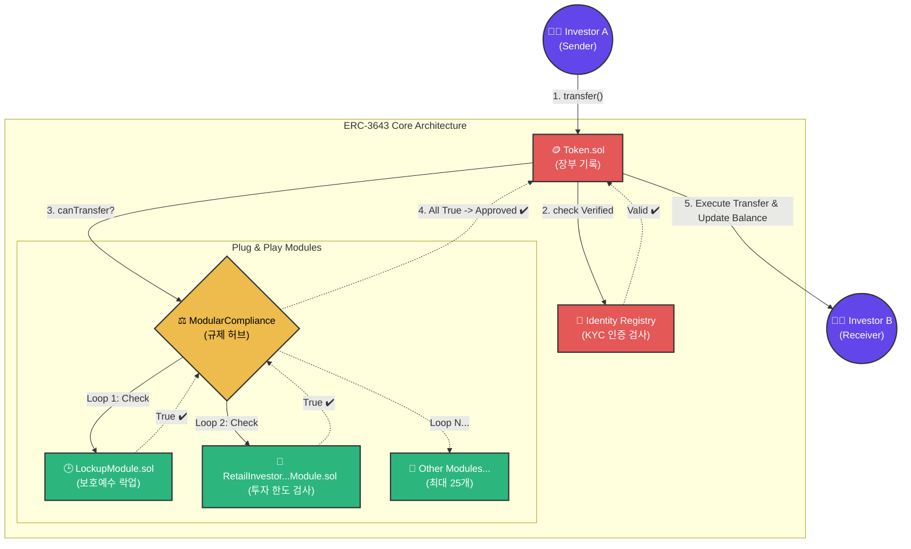

# ERC-3643 Modular Compliance 아키텍처 상세 분석

ERC-3643 (과거 T-REX) 프로토콜은 증권형 토큰(STO) 및 RWA(Real World Asset) 토큰을 퍼블릭 이더리움 메인넷 및 EVM 호환 네트워크에서 **합법적으로** 거래할 수 있도록 고안된 "허가형(Permissioned)" 스마트 컨트랙트 프레임워크입니다.

이 문서에서는 ERC-3643의 핵심 설계 원칙인 **'모듈러 컴플라이언스(Modular Compliance)'** 아키텍처를 상세히 정리합니다.

---

## 1. 아키텍처 분리의 필요성

전통적인 ERC-20 토큰은 "잔고(Registry)"와 "전송 로직(Transfer)"을 하나의 스마트 컨트랙트(`Token.sol`)에 묶어 둡니다. 이는 코드의 배포와 관리가 쉽다는 장점이 있으나, 토큰 증권이나 RWA와 같이 금융 당국의 **법적 규제**를 따르는 자산에는 치명적인 약점이 됩니다.

- **문제점:** 만약 국가의 법(예: 1회 투자 한도 조정, 보호예수 기간 연장 등)이 변경되면, 하드코딩된 ERC-20 스마트 컨트랙트를 폐기하고 토큰을 새로 발행(Migration)해야 합니다. 이는 막대한 수수료와 트래킹 오류를 불러옵니다.
- **해결책 (ERC-3643):** "장부를 기록하는 부서(Token)" 와 "법이 지켜지는지 검사하는 부서(Compliance)"를 **완벽히 분리**합니다.

---

## 2. 3단계 핵심 모듈 구조 (Separation of Concerns)

ERC-3643은 크게 3개의 독립적인 컨트랙트 그룹으로 나뉘어 서로 협업(Binding)합니다.

### A. Token Contract (본체 및 장부 부서)
아무런 검증 로직 없이 **잔고 업데이트**만 수행합니다. 그러나, 무언가(Transfer, Mint, Burn)를 하기 직전에 반드시 아래 두 부서에 "이거 실행해도 돼?"라고 허락을 구하도록 강제되어 있습니다.

### B. Identity Registry (신원 인증 부서)
송신자(Sender)와 수신자(Receiver)의 지갑 주소 백그라운드에 ONCHAINID(탈중앙 신원 증명)가 올바르게 연결되어 있는지, 이메일/여권/주소 인증(KYC/AML) 서류가 최신 상태인지 온체인에서 확인합니다.

### C. Modular Compliance (법무 및 규제 총괄 부서) - 🔥 핵심
Token.sol에서 승인 요청이 들어오면, 거래가 세부적인 운영 정책과 규제 룰북에 맞는지 최종 관문을 열어줍니다. 여기서 중요한 것은 `ModularCompliance` 자체가 어떤 규칙을 품고 있지 않다는 것입니다. 대신, **개별 규칙들(서랍장)을 꽂았다 뺄 수 있는 허브(Hub)** 역할을 합니다.

---

## 3. Plug & Play (플러그 앤 플레이) 결합 파이프라인

모듈러 컴플라이언스 프레임워크가 실제로 동작하는 파이프라인은 아래와 같습니다.

### [Phase 1: 배포 및 결합(Binding)]
1. 자산 운용사 및 발행 기관이 `Token.sol`, `IdentityRegistry`, `ModularCompliance` 를 각각 배포합니다.
2. 운영사가 필요한 세부 규제 모듈들을 따로 배포합니다. 
   - 예: `RetailInvestorLimitModule.sol` (소액 투자자 한도 관리)
   - 예: `LockupModule.sol` (보호 예수 기간 관리)
3. `ModularCompliance.sol`의 `addModule()` 함수를 이용해 방금 배포한 여러 개의 모듈들을 허브에 찰칵! 꽂아 넣습니다. (최대 25개까지 부착 가능)

### [Phase 2: 거래(Transfer) 실행 파이프라인]
투자자 A가 B에게 100개의 조각 투자(STO) 토큰 전송을 시도합니다:

1. `Token.sol` ➔ `ModularCompliance` 에게 거래 가능 여부 조회 (`canTransfer` 함수 호출)
2. `ModularCompliance`는 자신이 등록해둔 타 모듈 배열들을 **For 반복문**으로 하나씩 순회합니다.
3. **1번 모듈 (`LockupModule`) 체크:** 
   - "투자자 A의 락업 기간이 다 끝났는가?" ➔ **[OK 반환]**
4. **2번 모듈 (`RetailInvestorLimitModule`) 체크:** 
   - "이체 금액이 일반 투자자 상한선인 1,000만 원 이하인가?" ➔ **[OK 반환]**
5. 하나라도 False를 던지면 `revert` 됩니다. 모든 모듈이 성공(True)을 리턴하면, 허브가 `Token.sol`에게 최종 승인을 내립니다.
6. `Token.sol`이 실제로 잔고를 A에서 B로 이동시킵니다.

---

## 4. 아키텍처 다이어그램 (Mermaid)

